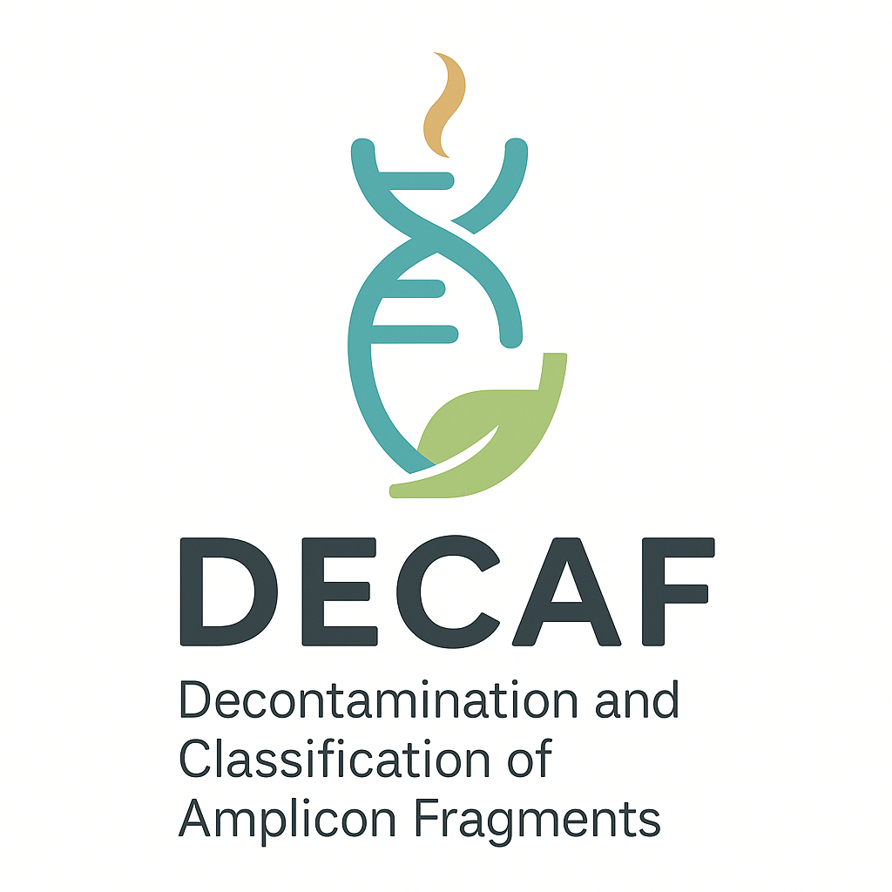

<!--  -->

[](https://opensource.org/licenses/MIT)
[](https://www.python.org/downloads/release/python-380/)
[](https://pypi.org/project/decaf/)
[](https://decaf.readthedocs.io/en/latest/?badge=latest)
[](https://github.com/psf/black)

# ☕ DECAF — *Decontamination and Classification of Amplicon Fragments*

**DECAF** is a bioinformatics framework for detecting and removing contamination in environmental DNA (eDNA) sequences. It leverages deep learning to classify amplicon fragments, enhancing the reliability of metabarcoding analyses.

> Currently supports ITS barcodes for plant contamination detection.  
> Future versions aim to support multiple barcodes and taxa.

---

## 🧬 Overview

DECAF is still under active development. For now, it provides a single deep learning model focused on **ITS barcodes** (ITS1, ITS2). The long-term goal is to offer a suite of models for diverse barcodes (e.g. COI, rbcL, 16S) across various taxonomic levels.

It can be:
- Integrated into existing pipelines like **OBITools**, **AmpliSeq**, or **QIIME**
- Used standalone for rapid filtering/classification of FASTA/FASTQ data
- Helpful in building clean reference databases for metabarcoding

---

## 🌱 Current Model: `ITS_Plant`

- **Barcode support**: ITS, ITS1, ITS2  
- **Input types**: Amplicons, ASVs  
- **Task**: Binary classification — *plant vs. contaminant*  
- **Output**: Filtered FASTA, prediction scores

---

## 📦 Installation

### Prerequisites

- Python 3.8 or higher
- Git
- NVIDIA graphics card (recommended for fast processing)

### Installing via PyPI

```bash
pip install decaf
```

### Installing from source

1. Clone the repository:
```bash
git clone git@github.com:UMMISCO/decaf.git
cd DECAF
```

2. Create a virtual environment:
```bash
python -m venv decaf-env
source decaf-env/bin/activate  # On Linux/Mac
# decaf-env\Scripts\activate  # On Windows
```

3. Install dependencies:
```bash
pip install -r requirements.txt
```

---

## 🏃 Quick Start

```bash
decaf --input_fastq data/test.fasta --output_folder output/ --taxa plants --barcode ITS --cpus 4 --threshold 0.99
```

For more options and examples, consult the complete documentation.

## 📚 Documentation

The complete documentation is available at:
[https://decaf.readthedocs.io](https://decaf.readthedocs.io)

To generate the documentation locally:

1. Install development dependencies:
```bash
pip install -r requirements.txt
```

2. Start the documentation server:
```bash
mkdocs serve
```

Then open your browser at: http://127.0.0.1:8000

## 🤝 Contributing

We welcome contributions to DECAF!

1. Open an issue to report bugs or suggest features
2. Create a pull request to contribute code
3. Follow the code style guidelines

To check your code style:
```bash
pip install black
black --check .
```

To format your code:
```bash
black .
```

## 🏗️ Project Structure

```
DECAF/
├── decaf/                 # Main code
│   ├── models/           # Model implementation
│   ├── data/             # Data management
│   └── utils/            # Utility functions
├── tests/                # Unit and integration tests
├── docs/                 # Documentation
├── config/               # Configuration files
└── data/                 # Example data
```

## 📜 License

DECAF is under the MIT license. See the [LICENSE](LICENSE) file for more details.

## 🙏 Acknowledgments

- [Auguste_GARDETTE](https://github.com/Aaramis) - Lead Developer
- [Contributors](https://github.com/Aaramis/DECAF/graphs/contributors) - All contributors

## 📞 Support

For any questions or issues, please open an issue on GitHub or contact the development team.
